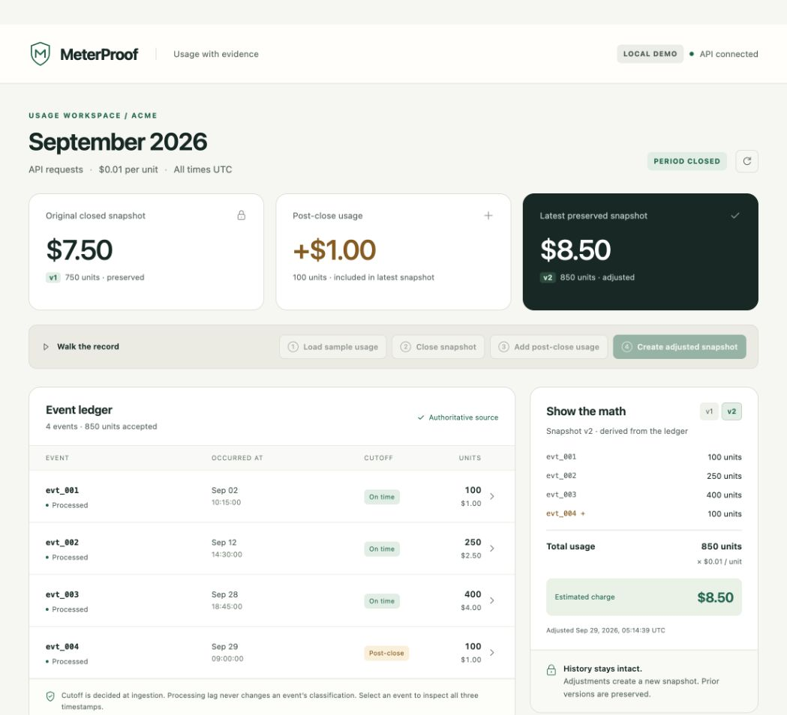

# Executed local verification

**Date:** 2026-09-28 America/Los_Angeles / 2026-09-29 UTC

**Operator:** Codex coding agent

**Target:** local workstation; no cloud deployment

| Executed check | Result |
| --- | --- |
| `npm run typecheck` | Passed |
| `npm test` | 13 passed, 0 failed |
| `npm run synth -- --no-lookups` | Passed; CloudFormation and both Lambda bundles generated |
| `npm run test:integration` | 6 passed, 0 failed, against DynamoDB Local |
| Browser verification | $7.50 original, +$1.00 post-close usage, $8.50 adjusted; v1 selection and event timestamp expansion verified; both snapshots persist across reload |
| `git diff --check` | Passed |

Integration checks executed:

1. Run the synthesized API and metering Lambda bundles against local DynamoDB: packaged HTML, health, ingestion, idempotency mismatch, close, stream-shaped delivery/replay, adjustment and preserved history.
2. Run the exact 100 + 250 + 400 + 100 fixture. Close before any stream processing, force two-item query pages, replay every event, preserve v1 and publish v2.
3. Force close to win between ingestion's period read and transaction commit. Verify retry becomes POST_CLOSE and stays out of v1.
4. Simulate process failure after the durable close fence. Recover it; then inject new usage after an adjustment fence and verify that usage stays pending for the next version.
5. Race eight processing attempts for one event. Verify one receipt and one aggregate increment.
6. Race eight ingestion requests against close. Verify snapshot membership exactly matches ON_TIME events and every accepted event is accounted for.

The domain suite additionally covers interrupted adjustment publication, same-operation retries, concurrent snapshot calls, invalid producer fields/dates, and sequence-number partial batch failure responses. Its deliberate failure-injection case prints `meter_record_failed`; the test passes by asserting that the failed record is returned for retry.

Runtime used: Node.js **25.8.1**, Java **17.0.20.1**, DynamoDB Local **3.3.1**. The deployed Lambda runtime is configured as **Node.js 22**; local execution was not an AWS Lambda Node.js 22 environment.

Downloaded DynamoDB Local archive SHA-256 (matched AWS's published checksum):

```text
f80bcec477f85f57e2c77f8d54aa6b672a8403fceff0c450560aee1cf6c21163
```

The local worker deliberately simulates delivery and uses the same transactional projector. DynamoDB Local and unit tests do **not** verify real AWS IAM, event-source mapping execution, service latency or production scaling. Authenticated coding-agent-to-AWS evidence and the cloud smoke test are still pending.


