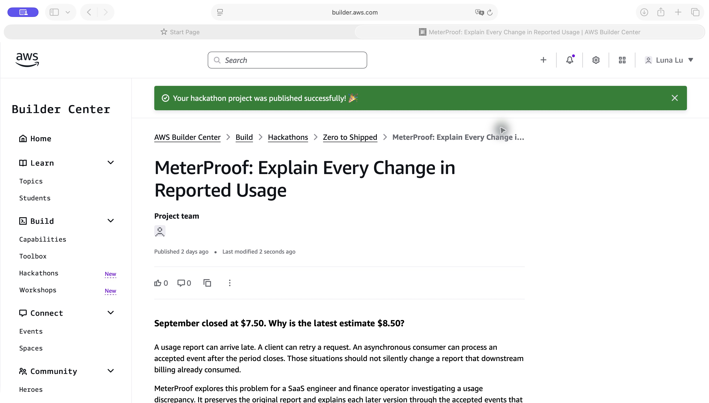

# October 2 release — deployed and verified

Application revision [`a7b18cf`](https://github.com/pstereoluna/MeterProof/commit/a7b18cf) was deployed by Codex to the existing `MeterProof` stack in `us-east-1` on October 2, 2026 Pacific (October 3 UTC). CloudFormation reached **UPDATE_COMPLETE**. [Open MeterProof](https://iqqd5bi25e.execute-api.us-east-1.amazonaws.com/).

## Release scope

The release fixes snapshot-build arithmetic overflow and large-total serialization/display. Normal totals retain their numeric JSON representation; totals above the safe integer range become exact decimal strings. An unfinished build from the former overflow path can resume using its original fence. Existing snapshots and ingestion/publication transaction boundaries remain unchanged. See the [API contract](../docs/api-contract.md) and [local regression evidence](numeric-overflow-verification.md).

The reviewed CDK diff changed only the code bundles of the two existing Lambda functions. No tables, IAM policies, routes or services were added or replaced. Existing bootstrap resources were reused. Browser login renewed the selected profile; STS confirmed it belonged to the original deployed account. CDK used the same-account credential fallback after helper-role assumption warnings, as in the earlier deployment; bootstrap/IAM permissions were not changed. Raw connection/deployment records remain private and git-ignored; no credentials are included in public evidence.

## Executed verification

| Verification | Result |
| --- | --- |
| Local typecheck and CDK synthesis | Passed |
| Unit, display, infrastructure and replay tests | 24 passed |
| DynamoDB Local, recovery, scenario and bundled-Lambda integration tests | 12 passed |
| Public AWS browser assertions | 36 passed at 1280×900 and 390×844 |
| Read-only cloud/artifact assertions | 17 passed |

Cloud verification downloaded each deployed Lambda artifact and checked its hash against AWS's reported code hash, then compared `index.js` with the corresponding tested local bundle. Both functions were Active with successful updates. Served HTML matched the released page, and the saved replay content was unchanged.

The complete live period equaled the pre-deployment capture: four accepted events, preserved snapshots of 750 and 850 units/cents, an ON_TIME aggregate of 750 with three processed events, all four original processing receipts, no pending usage and no unfinished build.

Browser verification covered all six scenes, duplicate/conflict explanations, v1/v2 derivation, preservation comparison, next/back/restart, independent visitors, responsive layout, loading controls and navigation to the current record. There were no page JavaScript errors. All 12 observed browser requests were GET requests; neither verification path added usage, closed, adjusted or reset the live period.

[Structured checks](release-2026-10-02-checks.json)

## Evidence limits

The recorded walkthrough still presents the historical AWS run from application revision `819c512`, observed September 30 Pacific / October 1 UTC. This release preserves that recording and does not relabel it as a new metering run.

Numeric overflow, exact large-value responses, original-fence recovery, races and controlled interruptions were exercised locally, including the synthesized Lambda bundle against DynamoDB Local. No large-quantity workload, forced Lambda crash, new Streams-delivery exercise or load test was performed in the shared cloud period. Artifact matching and successful read-only cloud checks establish the deployed code and unchanged demonstration, not production readiness or source completeness.

The user confirmed on October 2 that the competition's final submission had already been made. This release updates the existing project; that confirmation is user-reported and is not an independent verification of eligibility or judging status.

## Builder Center publication

Updated the existing project introduction, six-step walkthrough, latest verification links and dedicated Demo URL field on October 2. The project title, category, track, tags and repository link were preserved. The platform displayed “Your hackathon project was published successfully!” and the published page showed the updated content. This updates the same project; no new competition entry was created.

[Published project](https://builder.aws.com/project/3JzE9LF8ZJamr5T1eQDm6uNGngR/meterproof-explain-every-change-in-reported-usage) · [Published copy](../docs/submission.md)

