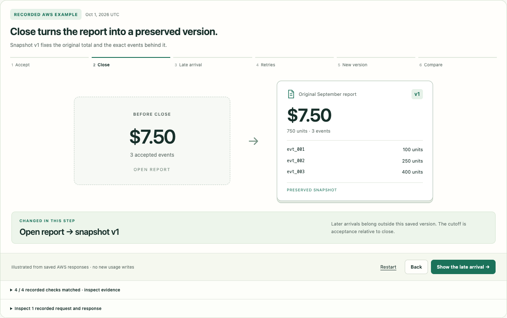
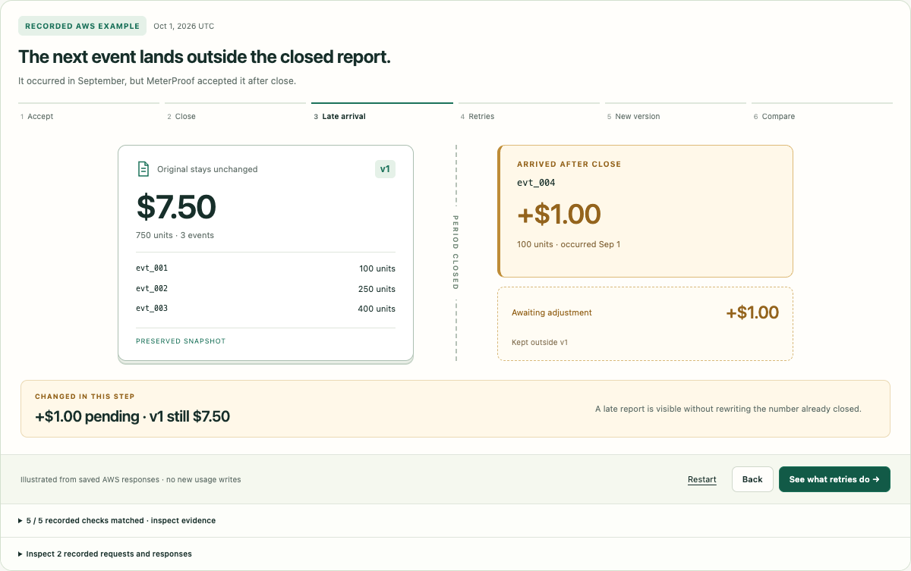
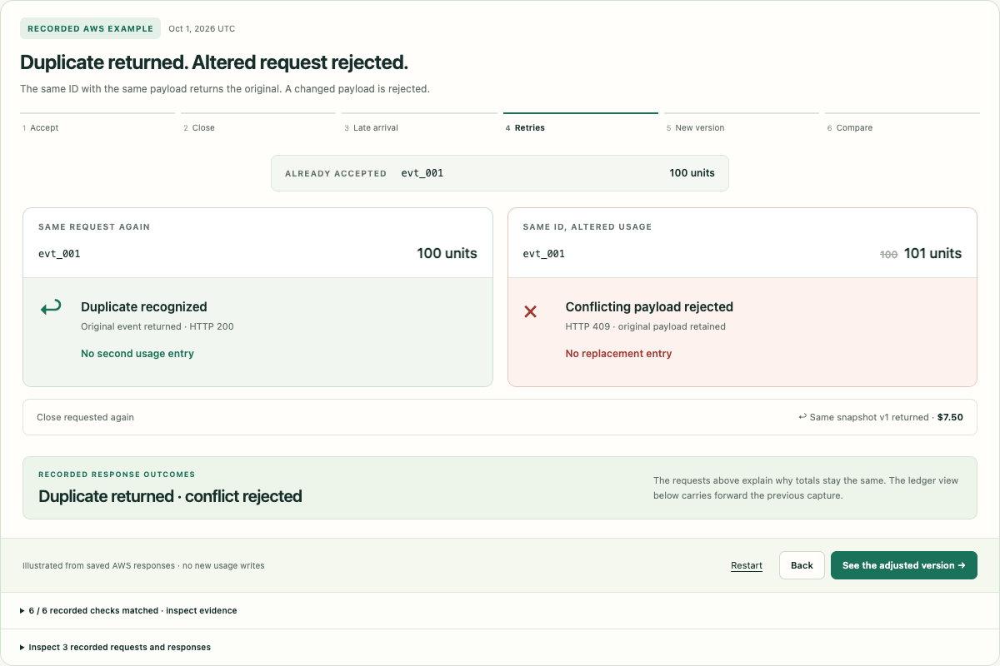
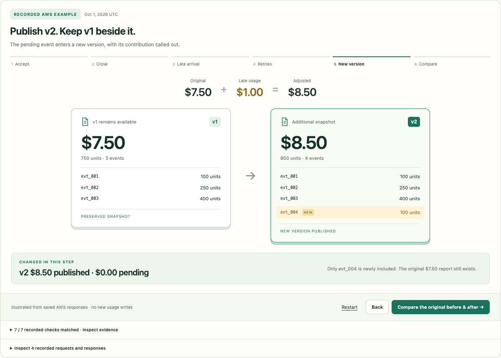
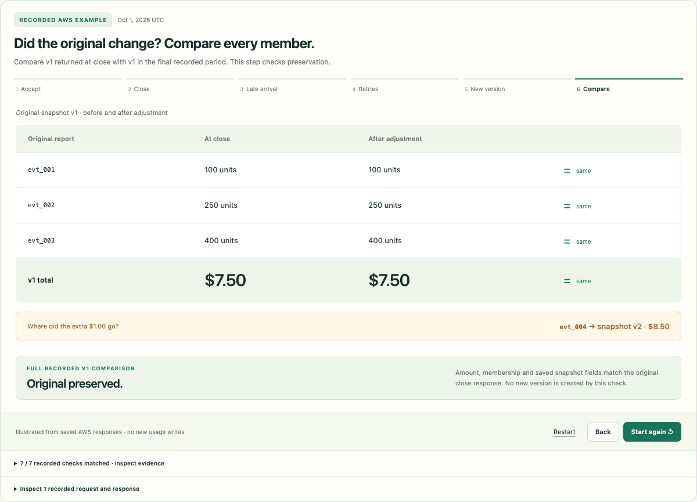

# Visual scene verification — October 1, 2026 (Pacific)

**Deployed and verified.** Application revision [`ddf8de0`](https://github.com/pstereoluna/MeterProof/commit/ddf8de0) runs on the existing `MeterProof` stack in `us-east-1`; CloudFormation reports `UPDATE_COMPLETE`. [Open the demo](https://iqqd5bi25e.execute-api.us-east-1.amazonaws.com/).

This presentation revision responds to visitor feedback that the mode buttons were redundant and steps 2–6 looked unchanged. Each step now has a distinct action/result scene; the ledger, derivations and raw evidence remain inspectable. The current record is a secondary link. Navigation reveals the new scene heading, including on mobile.

## Executed verification

- Typecheck, CDK synthesis, **17 unit/infrastructure tests and 9 integration tests** passed.
- The existing **eight-step local UI scenario** completed, preserving v1/v2/v3 and ending at $7.50 original, $0 pending and $11 latest.
- **36 browser assertions passed locally and again on AWS** at 1280 × 900 and 390 × 844, using independent visitor contexts. Checks covered all six scenes, distinct duplicate/conflict outcomes, the cutoff boundary, v1/v2 membership, before/after comparison, expandable derivations, next/back/restart, new-scene focus/scroll, secondary current-record navigation, and zero JavaScript errors or horizontal overflow.
- The browser checks deliberately held the recording response to verify disabled loading controls. The current-record navigation check waits for the destination page's ready state; an earlier assertion had raced that navigation.
- **11 read-only cloud assertions passed**: served HTML exactly matched the committed page, the replay artifact was unchanged, health remained AWS, and the complete live period matched the pre-deployment capture. Four events, snapshots 750/850, ON_TIME projection 750 and pending zero were preserved.
- Browser request logs contain only GET requests. The story never fetches `/api/period` until the secondary current-record link is followed. No event, close, adjustment or reset operation was issued.
- The reviewed CDK diff changed only the existing API function's bundle. Tables, IAM policies, routes, the Streams processor and core metering code were unchanged. Private deployment transcripts are retained separately.

[Structured browser and cloud results](visual-scenes-checks.json)

## What the visuals mean

The saved AWS source run is still commit `819c512`, captured September 30 Pacific / October 1 UTC. These scenes illustrate those observations; navigating them does not perform new metering work. The retry step explains an unchanged result through returned/rejected requests. The final step compares v1 from the close response with v1 in the final period response; it does not claim a new version or newly completed processing. Original cloud and local evidence records remain unchanged.

## Deployed scenes

### Close

### Late arrival

### Retry

### Adjustment

### Preservation check

