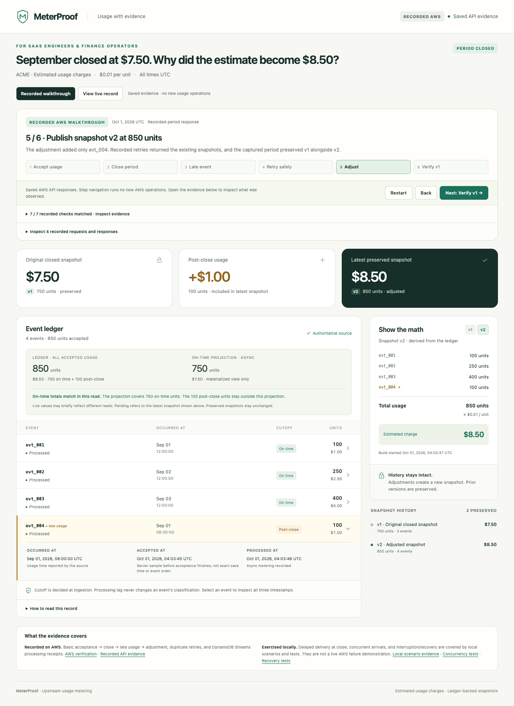

# Recorded walkthrough verification — October 1, 2026

**Deployed and verified on AWS.** Application revision [`5abec3f`](https://github.com/pstereoluna/MeterProof/commit/5abec3f) runs on the existing `MeterProof` stack in `us-east-1`. CloudFormation reports `UPDATE_COMPLETE`. [Open the repeatable walkthrough](https://iqqd5bi25e.execute-api.us-east-1.amazonaws.com/).

This record covers the new presentation and read-only replay endpoint, separately from the [historical metering smoke](cloud-verification.md).

## Executed checks

- TypeScript typecheck, **17 unit/infrastructure/exporter/route tests**, and CDK synthesis passed.
- **9 DynamoDB Local integration tests** passed, including the synthesized Lambda bundle serving the exact replay artifact and leaving its initially empty ledger empty.
- The exporter regenerated `web/replay.json` byte-for-byte from the private historical API smoke files. Its **33 checks** derive from saved responses; they are not a new cloud metering run. The artifact excludes headers, credentials, account identifiers and private paths.
- **30 browser assertions passed locally and again against the public AWS URL**, in separate desktop (1280 × 1000) and mobile (390 × 844) contexts. Checks cover independent first visits, six-step navigation, back/restart, explicit +$1.00, preserved $7.50, adjusted $8.50, both derivations, conflict evidence, and live/replay switching. No JavaScript errors or horizontal overflow were observed. [Structured results](walkthrough-checks.json).
- The initial public-browser check exposed an enabled button before the recording loaded. The corrected page initializes controls as disabled. A browser-held recording response verifies that behavior; this is a client loading-state test, not cloud fault injection.
- Each recorded walkthrough fetched only the page, health and recording. It never requested the live period until **View live record** was clicked. Both modes sent **zero POST requests**.
- A fresh isolated **eight-step local UI scenario** completed, preserving v1/v2/v3 and ending at $7.50 original, $0.00 pending and $11.00 latest. This used DynamoDB Local and controlled fault delivery.
- **11 read-only post-deployment cloud assertions passed.** Served HTML and replay content match the committed files exactly. The entire live period response remained equal to its pre-update capture, including four events, snapshots 750/850, ON_TIME aggregate 750 and pending zero. This comparison was repeated after the public browser visits.

## Deployment and coding-agent evidence

Codex detected the expired AWS CLI login, started browser reauthentication, and verified that the renewed session targeted the original account. The sanitized STS connection record and full deployment transcripts are retained privately. The pre-deployment diff added `GET /api/replay`, its route-scoped Lambda invoke permission, and the existing API function's code update. Tables, the metering function and application IAM policies were unchanged. The loading-state follow-up updated only the API bundle.

CDK used the same-account credential fallback after helper-role assumption warnings, as in the original deployment. No bootstrap changes, new services, reset endpoint or metering writes were issued. This verifies agent-to-AWS usage through browser sign-in, STS, CLI and CDK; it does not claim an AWS MCP connection.

## Evidence boundaries

The artifact replays saved AWS responses from application commit `819c512`, captured October 1, 2026 at 04:03:42–04:03:48 UTC (September 30 Pacific). Accept/close/retry views are reconstructed and labeled. Missing aggregate observations stay null; a missing receipt in a reconstructed step means not observed, not proof of lag. Late/adjust/verify use full captured period responses.

The UI update changes no metering transactions or authentication. Existing unauthenticated mutation APIs still exist; read-only presentation is not authorization. The historical cloud run did not force crashes, cutoff races, load or stream expiry. Those claims remain separate from local tests.

## Public AWS browser captures

[Mobile capture of the deployed page](walkthrough-mobile.png)
